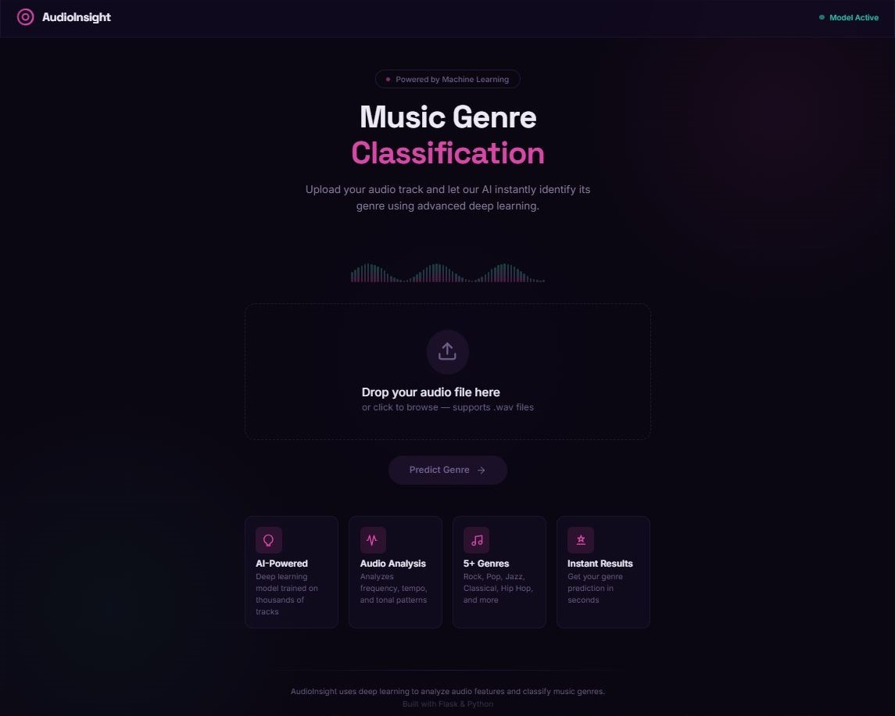
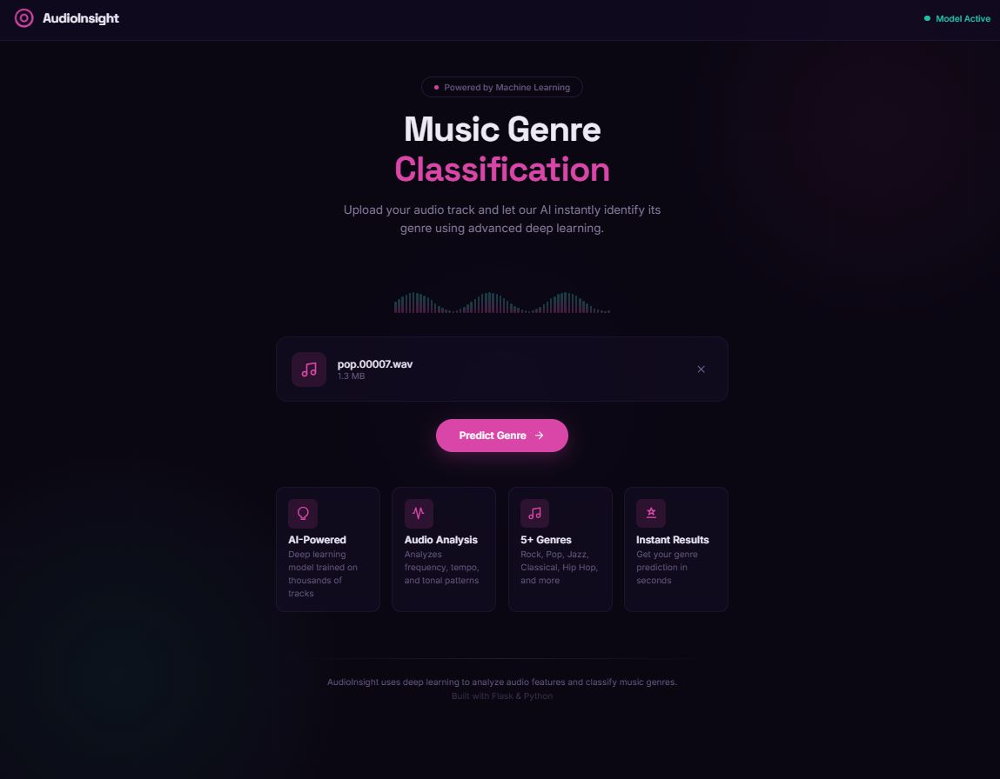
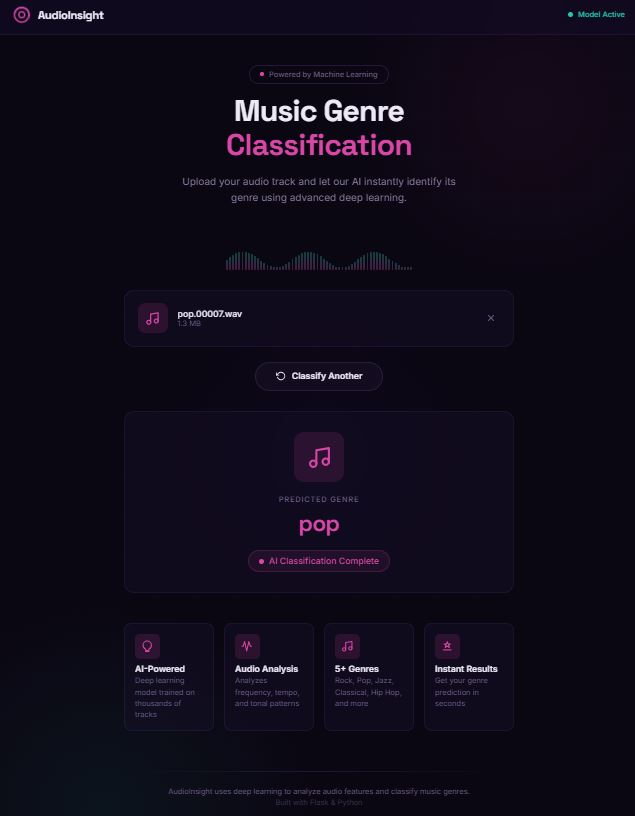

# AudioInsight - AI Music Genre Classification

<p align="center">
  
  <br/>
  <em>Figure 1: AudioInsight web interface with modern design</em>
</p>

---

## Overview

AudioInsight is a web application that uses machine learning to automatically classify music genres from audio files. Built with Flask and powered by a trained classification model, it analyzes audio features using MFCC (Mel-Frequency Cepstral Coefficients) to identify the genre of uploaded music tracks.

The application supports classification across **10 music genres**: Blues, Classical, Country, Disco, Hip Hop, Jazz, Metal, Pop, Reggae, and Rock.

---

## Features

- **Instant Genre Prediction**: Upload any WAV audio file and get instant genre classification
- **AI-Powered Analysis**: Uses deep learning techniques with MFCC feature extraction
- **Modern UI**: Beautiful glassmorphism design with smooth animations
- **Responsive Design**: Works on desktop and mobile devices
- **Fast Processing**: Quick audio analysis and prediction

---

## Tech Stack

### Backend
- **Python 3.x** - Programming language
- **Flask** - Web framework
- **Librosa** - Audio analysis library
- **Scikit-learn** - Machine learning framework
- **NumPy** - Numerical computing

### Frontend
- **HTML5** - Markup language
- **CSS3** - Styling (custom properties, glassmorphism)
- **JavaScript** - Client-side logic

---

## Project Structure

```
Music Genre Classification/
├── app.py                      # Flask application and ML inference
├── music_genre_model.pkl       # Trained classification model
├── temp.wav                    # Temporary storage for uploads
├── README.md 
├── templates/
│   ├── index.html              # Main web interface
└── assets/
    └── screenshots/            # Project screenshots
        ├── landing.jpg
        ├── upload.jpg
        ├── predict.jpg
```

---

## Installation

### Prerequisites

- Python 3.8 or higher
- pip (Python package manager)

### 1. Clone the Repository

```
bash
git clone <repository-url>
cd "Music Genre Classification"
```

### 2. Create Virtual Environment (Recommended)

```
bash
# Windows
python -m venv venv
venv\Scripts\activate

# macOS / Linux
python3 -m venv venv
source venv/bin/activate
```

### 3. Install Dependencies

```
bash
pip install flask librosa scikit-learn numpy joblib
```

### 4. Download/Place Model

Ensure `music_genre_model.pkl` is in the project root directory. This is your trained classifier model.

---

## Usage

### Starting the Application

```
bash
python app.py
```

The server will start at `http://127.0.0.1:5000`

### Using the Web Interface

1. Open your browser and navigate to `http://127.0.0.1:5000`
2. You'll see the landing page with the upload zone
3. Click the upload area or drag and drop a `.wav` audio file
4. Click **"Predict Genre"** button
5. Wait for the AI to analyze the audio
6. View the predicted genre result!

### Supported Audio Formats

- **.wav** - Waveform Audio File Format (primary)

---

## How It Works

### Audio Feature Extraction

The system uses **MFCC (Mel-Frequency Cepstral Coefficients)** to extract meaningful features from audio signals:

1. **Audio Loading**: Librosa loads the WAV file (30-second duration)
2. **MFCC Extraction**: Extracts 20 MFCC coefficients from the audio
3. **Feature Averaging**: Computes mean values across time frames
4. **Feature Vector**: Creates a flattened feature vector for prediction

### Genre Prediction

1. The extracted features are fed to the trained Random Forest classifier
2. Model predicts the genre from 10 classes
3. Results are returned as JSON and displayed in the UI

---

## Model Information

- **Algorithm**: Random Forest Classifier
- **Training Features**: 20 MFCC coefficients
- **Supported Genres**:
  - Blues
  - Classical
  - Country
  - Disco
  - Hip Hop
  - Jazz
  - Metal
  - Pop
  - Reggae
  - Rock

---

## API Endpoints

| Endpoint | Method | Description |
|----------|--------|-------------|
| `/` | GET | Serve the main web interface |
| `/predict` | POST | Accept audio file and return genre prediction |

### Prediction API Example

```
bash
curl -X POST -F "file=@your_audio.wav" http://127.0.0.1:5000/predict
```

**Response:**
```
json
{
  "genre": "rock"
}
```

---

## Screenshots

<p float="left">
  
  
</p>
<p><em>Left: Landing page with upload zone. Right: Uploaded file and prediction results.</em></p>

---

## Development

### Training Your Own Model

If you want to train a custom model:

```
python
import librosa
import numpy as np
from sklearn.ensemble import RandomForestClassifier
from sklearn.model_selection import train_test_split
import joblib

# 1. Load audio files and extract features
# 2. Create feature matrix X and labels y
# 3. Train the model
model = RandomForestClassifier(n_estimators=100)
model.fit(X, y)

# 4. Save the model
joblib.dump(model, 'music_genre_model.pkl')
```

### Customizing Genres

To add or remove genres, update the `genres` list in `app.py`:

```
python
genres = ['blues', 'classical', 'country', 'disco', 
          'hiphop', 'jazz', 'metal', 'pop', 'reggae', 'rock']
```

---

## Troubleshooting

### Common Issues

1. **"No file uploaded" error**
   - Ensure you're uploading a `.wav` file
   - Check that the file size is under the server limit

2. **Model loading error**
   - Verify `music_genre_model.pkl` exists in the project root
   - Ensure the model was trained with the same feature extraction method

3. **Librosa errors**
   - Install ffmpeg for additional audio format support: `pip install ffmpeg-python`

---

## License

This project is for educational and demonstration purposes.

---

## Acknowledgments

- [Librosa](https://librosa.org/) - Audio analysis
- [Scikit-learn](https://scikit-learn.org/) - Machine learning
- [Flask](https://flask.palletsprojects.com/) - Web framework
